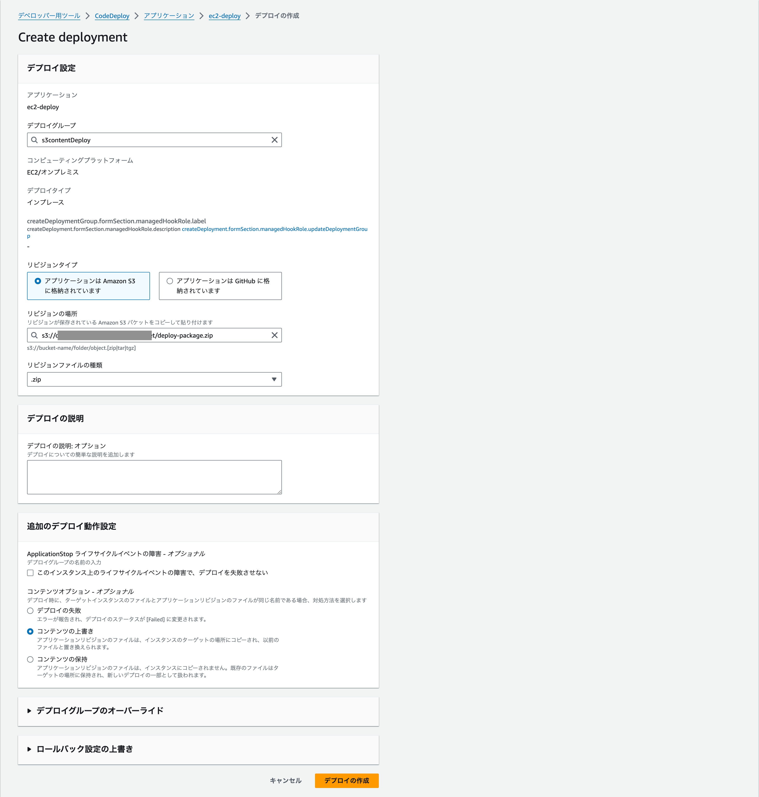

# aws-frontend-s3-deploy

s3 bucket deployment with codeDeploy

> [!NOTE]
> 
> アプリケーションをS3に配置してそれをCodeDeployでEC2にデプロイするサンプル

## 準備

### ポリシーの作成
**EC2用のIAMロールを作成しポリシーをアタッチする**

| ロール名 | ポリシー |
|:----- |:----- |
|　任意の名前 | AmazonEC2RoleforAWSCodeDeploy <br>AmazonSSMManagedInstanceCore <br>AmazonS3ReadOnlyAccess  |

**CodeDeploy用のIAMロールを作成しポリシーをアタッチする**

| ロール名 | ポリシー |
|:----- |:----- |
|　任意の名前 | AWSCodeDeployRole |
---
### S3のバケット作成
バケット名は任意の名前で作成する
1. パブリックアクセスをすべてブロック [バケット→アクセス許可]
2. バケットのバージョニングを有効にする　[バケット→バケットのバージョニング]

**バケットポリシーを設定する**

```json
{
    "Version": "2012-10-17",
    "Statement": [
        {
            "Effect": "Allow",
            "Principal": {
                "AWS": "CodeDeployRoleのARN"
            },
            "Action": [
                "s3:Get*",
                "s3:List*"
            ],
            "Resource": "対象のバケットのARN"
        }
    ]
}
```

### EC2
ミドルウェア関係のインストールは省略

- タグを設定する　
Key: CodeDeploy Value: True <br>(CodeDeployのフィルタリングに使用任意です)
- 前述したIAMロールをアタッチする
アタッチされたか確認する
```bash
aws ec2 describe-instances --instance-ids {instace-id} --query 'Reservations[].Instances[].IamInstanceProfile.Arn'
```
- CodeDeployエージェントのインストール
```bash
sudo yum update -y
sudo yum install -y ruby
sudo yum install -y wget
cd /home/ec2-user
wget https://aws-codedeploy-ap-northeast-1.s3.amazonaws.com/latest/install
chmod +x ./install
sudo ./install auto
```


### CodeDeploy

E.g: [https://ec2.cristallum.io/](https://ec2.cristallum.io/)

- アプリケーションの作成
- デプロイグループの作成
    - デプロイグループ名
    - サービスロール (前述に作成したCodeDeploy用のIAMロールを指定)
    - デプロイタイプ （インプレースかBlue/Greenのどちらかを選択）
- 環境設定
    - Amazon EC2 インスタンスを選択
    - タググループ　EC2で指定したタグを設定
- デプロイ設定
    - CodeDeployDefault.OneAtATimeを選択(運用次第で変更)
- Load balancer
  - ロードバランサーを使う場合は「ロードバランサーを使用する」を選択

### アプリケーションのデプロイ
- S3にアプリケーションをアップロード
- CodeDeployでデプロイを実行



